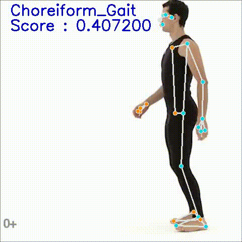

# Diagnosis of gait disorder by Human pose estiamtion [](https://hits.seeyoufarm.com)


## Our Model Output




## Our Team
- TaeYun Kim (💻 School of Computer Science & Engineering, Chung-Ang Univ.)
- MinKi Kang (💻 School of Computer Science & Engineering, Chung-Ang Univ.)
- JuHo Lee (💻 School of Computer Science & Engineering, Chung-Ang Univ.)


## Install

Before running this program, **please create a virtual environment by running the code below for a better execution environment.** 

```python
$ conda create -n Gait_Classifier python=3.8
$ conda activate  Gait_Classifier
$ pip install -r requirements.txt
```
This code was tested with `python 3.8.13`, `pycaret 1.9.0`, `mediapipe 0.8.10.1`  

## How to Use

**Please Check Gait_Classification_Demo**


